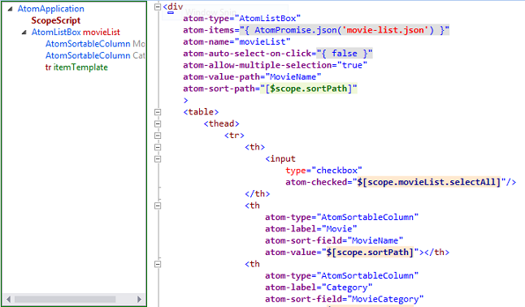

Atoms.js
========
Enterprise Grade JavaScript UI Framework inspired from Flex and Silverlight.

Atoms.js is the only JavaScript framework with precompiler [Atoms.js PreCompiler](https://github.com/neurospeech/atoms-pre-compiler).
AtomsPreCompiler compiles atoms markup into valid HTML5 by breaking up inline expressions into
generated JavaScript. This pre-compiled document runs in strict mode without using `eval` without compromising speed.

Visual Studio Auto Intellisense - Atoms.js Power Tools 2013
-----------------------------------------------------------

Download: https://visualstudiogallery.msdn.microsoft.com/6956fdb0-174b-4e4c-9bef-e2ed76f1a199

Features
--------
1. Inbuilt support for MVVM (async/await support with TypeScript)
2. Less JavaScript - More HTML
3. Poweful Web Components
4. Compilation to JavaScript with valid HTML5 markup
5. Consistent and Logical Syntax
6. Extensibility
7. One Time, One Way and Two Way Bindings
8. Component Object Model
9. One Liner AJAX
10. Powerful State Machine
11. Customizable Templates
12. Scalability (Able to manage 1000s of rows of data)
13. Application State Persistance in URL
14. Multiple Scopes for Scope Isolation
15. Ready to use Line of Business Components
16. Works on Internet Explore 9+ (IE8 is supported but you may have to rewrite CSS), Firefox 10+, Chrome 10+, Safari 4+ and any WebKit based Browser

Atoms.js (previously known as Web Atoms JS) is inspired from Adobe Flex and Microsoft Silverlight and has very small learning curve. 
The project contains text template defined in Visual Studio C# Project which recreates output JS files and CSS files.

Download Free Book
------------------
A complete guide for Atoms.js is included in this book, the book is available only for personal use with no redistribution and no print rights.
[Download Atoms.js eBook](https://s3.amazonaws.com/webatoms/Documentation.pdf)

Build Instructions
------------------
Building Atoms.js project is very easy, you need Visual Studio 2012 onwards and you have to just transform all T4 text templates.

Model Interactive View Controller Pattern
-----------------------------------------
Web application usually contains dual MVC Frameworks, one on server side and another on client side. Maintaining two different MVC is difficult. MVC is good for server side where flow of data is simple as request-process-response. Client side UI frameworks need much more than that. Thats why with Atoms.js, Model and Controller remains on server side, Interactive View is at client side, and interactive view communicates with server with JavaScript Promises (One Liner AJAX).

Atoms.js is built using Component Object Modeling which expose properties for model, and commands for manipulating them. Components can be adujsted on document and data binding and command binding makes them absolutely free of JavaScript.

Each MVC JavaScript requires you to fully understand JavaScript, where else Atoms.js can be used by designers without knowing much of JavaScript. 

Documentation
-------------

<a href="http://atoms.azurewebsites.net/docs/index.html" target="_blank">Hosted Documentation</a>

In order to view documentation with all samples, you can simply run the Visual Studio Project and test each sample along with the documentation.

For non Windows platform, you may have to use Apache or some similar web server to host this project as website and then open it on any browser. Since AJAX is disabled on all browsers while accessing it from file:// URI pattern, simply opening index.html on browser will not be sufficient. You can view all documentation without any problems, but to run samples with AtomPromise, you will need a web server.

